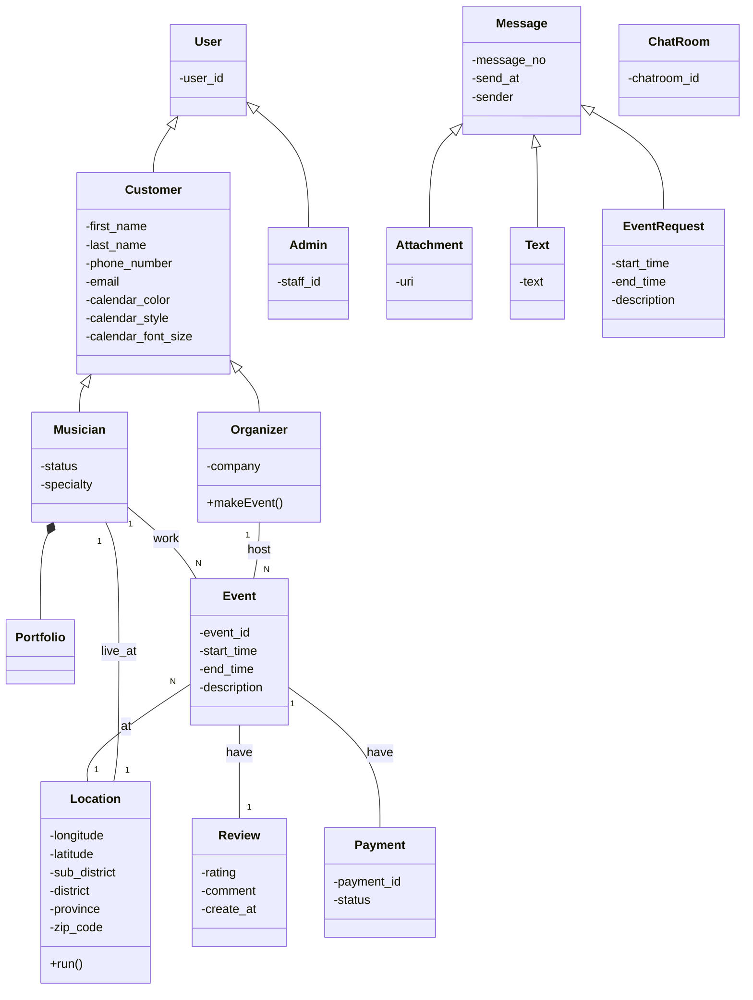

```mermaid
classDiagram

    User <|-- Customer
    User <|-- Admin
    Customer <|-- Musician
    Customer <|-- Organizer

    class User {
        -user_id
    }
    
    class Admin {
        -staff_id
    }

    class Customer {
        -first_name
        -last_name
        -phone_number
        -email
        -calendar_color
        -calendar_style
        -calendar_font_size
    }

    class Musician {
        -status
        -specialty
    }

    class Portfolio {
    
    }

    Musician *-- Portfolio

    class Organizer {
        -company
        +makeEvent()
    }

    class Event {
        -event_id
        -start_time
        -end_time
        -description
    }

    Location "1" -- "1" Musician: live_at
    Musician "1" -- "N" Event: work
    Event "N" -- "1" Location: at
    Organizer "1" -- "N" Event: host
    
    class Location {
        -longitude
        -latitude
        -sub_district
        -district
        -province
        -zip_code
        +run()
    }

    class Review {
        -rating
        -comment
        -create_at
    }

    class Payment {
        -payment_id
        -status
    }

    Event "_" -- "1" Review: have
    Event "1" -- "_" Payment: have

    Message <|-- Attachment
    Message <|-- Text
    Message <|-- EventRequest

    class ChatRoom {
        -chatroom_id
    }

    class Message {
        -message_no
        -send_at
        -sender
    }

    class Attachment {
        -uri
    }

    class Text {
        -text
    }

    class EventRequest {
        -start_time
        -end_time
        -description
    }

    

```